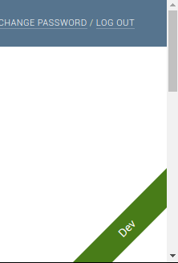

django-admin-ribbon
===================

Overlays a configurable ribbon across the admin-ui, in order to differentiate between environments.

For example:

Requirements
------------

* Python: Any version
* Django: 1.8 and over

Setup
-----

Install from pip:

    pip install django-admin-ribbon
   
   
Add `'adminribbon'` to your `INSTALLED_APPS`, before `'django.contrib.admin'` (because we override their template).

    INSTALLED_APPS = (
        ...
        'adminribbon',
        'django-contrib.admin',
        ...
    )
 

Add `'adminribbon.context_processors.from_settings'` to the templates `'context_processors'`.

For each environment (usually in different settings files) configure the text and color of the ribbon, for example:

    ADMIN_RIBBON = {
        'TEXT': 'Dev',
        'COLOR': 'green',
    }

Credits
-------

Inspired by https://hackernoon.com/5-ways-to-make-django-admin-safer-eb7753698ac8
